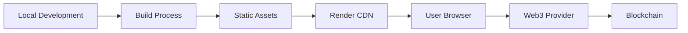

# DApp Architecture and Deployment Guide

## Understanding Your DApp's Architecture

### Frontend Architecture
Your DApp is a React application that gets built into static assets but provides dynamic functionality through:

1. **Client-Side Rendering**
   - React handles UI updates
   - State management for user interactions
   - Dynamic routing
   - Real-time updates

2. **Web3 Integration**
   - Direct blockchain interactions
   - Smart contract calls
   - Wallet connections
   - Transaction handling

3. **Dynamic Features**
   - Real-time balance updates
   - Live transaction status
   - Wallet state management
   - NFT minting interface
   - Token transfers

### Backend Architecture

Your DApp's "backend" consists of:

1. **Smart Contracts** (On-Chain)
   - AGIToken.sol: Token logic
   - AgentNFT.sol: NFT functionality
   - Deployed on Ethereum network

2. **Web3 Infrastructure**
   - Infura/Alchemy as RPC providers
   - MetaMask/Web3 wallet integration
   - Blockchain as the database

## Why Static Hosting Works

Despite being a dynamic application, your DApp can be hosted as a "static site" because:

1. **Build Process**
   ```
   Your React App (Dynamic) → Build Process → Static Assets
   ```
   - HTML/CSS/JavaScript bundle
   - All dynamic logic included in JS
   - No server-side rendering needed

2. **Dynamic Operations**
   ```
   User → Static Frontend → Web3 Provider → Blockchain
   ```
   - All dynamic operations happen through:
     * Client-side JavaScript
     * Web3 providers
     * Smart contract interactions

3. **State Management**
   - User state: Managed by React
   - Blockchain state: Accessed via Web3
   - No backend database needed

## Deployment Options on Render

### 1. Static Site Hosting (Recommended)
- Deploy built React application
- Configure environment variables
- Set up build process
- Enable SSL

Benefits:
- Simpler deployment
- Better caching
- Lower costs
- Automatic CDN

### 2. Web Service (Alternative)
- Could be used if you later add:
  * Custom API endpoints
  * Server-side rendering
  * Backend services

Current architecture doesn't require this.

## Best Practices for Your Architecture

### 1. Frontend Organization
```
src/
  components/         # React components
    DappInterface/    # Web3 interaction UI
    LandingPage/     # Static content
  contracts/         # Contract ABIs/Types
  utils/
    web3.ts          # Web3 configuration
```

### 2. Contract Interaction Flow
```
User Action → React Component → Web3 Instance → Smart Contract
     ↑                                              ↓
     └──────────── State Update via Events ─────────┘
```

### 3. Environment Configuration
```
Frontend Build
  ↓
Environment Variables
  ↓
Web3 Provider Config
  ↓
Contract Interactions
```

## Scaling Considerations

### Current Setup (Static Hosting)
- Scales with blockchain, not server
- CDN distribution
- No backend bottlenecks
- Limited by Web3 provider rates

### Future Expansion
If you need to add:
1. **Backend API**
   - Switch to Web Service
   - Add API routes
   - Keep static hosting for frontend

2. **Database**
   - Add PostgreSQL
   - Use Render's managed database

3. **Server-Side Operations**
   - Add Express/Node.js backend
   - Configure as Web Service

## Cost-Performance Benefits

### Static Hosting
- Free tier available
- Global CDN included
- Automatic scaling
- No server maintenance

### Infrastructure Costs
- Render: $0-20/month
- Web3 Provider: $0-50/month
- Contract Deployment: One-time gas fee

## Deployment Flow



## Conclusion

Your DApp is a dynamic application that can be served as static assets because:
1. All dynamic interactions are client-side
2. Blockchain provides the backend
3. Web3 providers handle RPC calls

This architecture is optimal for:
- Cost efficiency
- Scalability
- Maintenance
- Security

The static hosting approach on Render is ideal for this architecture, providing all needed capabilities while maintaining simplicity and cost-effectiveness.
